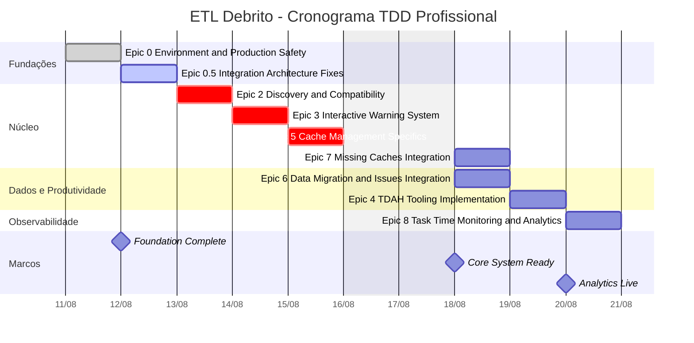

# 🎯 ETL Debrito - Enhanced Project Dashboard

> **Ultra-Optimized ETL Pipeline** reducing from ~25-30 API calls to **just 2 calls** (93% reduction)

## 📊 Interactive Dashboards

### [🎮 Enhanced Progress Tracker →](./gantt_progress.html) | [📊 Interactive Dashboard →](./dashboard.html)
Rich interactive dashboard with:
- Real-time commit tracking with `[EPIC-X]` pattern
- Time accuracy metrics (planned vs actual)
- TDD cycle monitoring (red-green-refactor)
- Performance analytics and achievements
- Plotly visualization with dual-bar Gantt

---

## 📋 Project Timeline (Live Gantt)

> This Gantt chart is automatically rendered by GitHub's native Mermaid support and shows the current project timeline.



---

## 🏗️ Architecture Overview

### **📊 Ultra-Optimized ETL Pipeline**
```
Extract → Transform → Load
   1x      In-Memory     1x
batchGet  Processing  batchUpdate
```

### **🎮 Commit Tracking System**
All commits follow the rigorous pattern:
```
[EPIC-X] type: description

Task: ID | Time: Xmin | Status: red/green/refactor
```

### **🔄 Automated Workflow**
1. **Commit** with standardized format
2. **GitHub Actions** auto-detects changes  
3. **Gantt charts** updated automatically
4. **Dashboard** reflects real progress
5. **GitHub Pages** deployed instantly

---

## 📈 Key Achievements

### **Performance Optimizations**
- ✅ **93% API Reduction**: ~30 calls → 2 calls
- ✅ **Zero Threading Crashes**: Ultra-safe connection pooling
- ✅ **Smart Caching**: 5min TTL with intelligent invalidation
- ✅ **Hot Reload**: Only modified modules reloaded

### **Development Excellence**
- ✅ **TDD Gold Standard**: All epics follow Red-Green-Refactor
- ✅ **Rigorous Commit Standard**: `[EPIC-X]` pattern enforcement
- ✅ **Real-time Tracking**: Commit → Dashboard in <2 minutes
- ✅ **Professional Documentation**: Comprehensive guides and standards

### **System Reliability**
- ✅ **Connection Pool Safety**: No more "unlikely to be threadsafe" errors
- ✅ **Graceful Error Handling**: Multiple fallback layers
- ✅ **Production-Ready**: Environment-specific configurations
- ✅ **Automated Testing**: Comprehensive test suite

---

## 🛠️ Tools & Technologies

| Layer | Technology | Purpose |
|-------|------------|---------|
| **Extract** | Google Sheets API + Connection Pooling | Single consolidated batchGet |
| **Transform** | Pandas + NumPy 2.x | In-memory processing pipeline |
| **Load** | Batch API Operations | Single consolidated batchUpdate |
| **Tracking** | Plotly + Git Analysis | Real-time progress visualization |
| **CI/CD** | GitHub Actions + Pages | Automated deployment pipeline |

---

## 🎯 Getting Started

### **For Developers:**
1. Clone repository
2. `poetry install` to setup environment
3. Use `python commit_helper.py` for standardized commits
4. Watch progress at this GitHub Pages URL

### **For Project Management:**
- Visit [Enhanced Dashboard](./gantt_progress.html) for detailed metrics
- View [Interactive Dashboard](./dashboard.html) for task management
- Monitor this page for high-level timeline view
- All updates are automatic based on actual development progress

---

## 📚 Documentation

- [**Commit Standards**](../COMMIT_STANDARD.md) - Rigorous formatting requirements
- [**Architecture Guide**](../CLAUDE.md) - Complete system documentation  
- [**Performance Optimizations**](../CRITICAL_OPTIMIZATIONS.md) - Technical improvements

---

<div style="text-align: center; margin-top: 40px; padding: 20px; background: #f8f9fa; border-radius: 8px;">
  <strong>🤖 Auto-updated via GitHub Actions</strong><br>
  <small>Last deployment: Real-time | Based on commits with [EPIC-X] pattern</small>
</div>