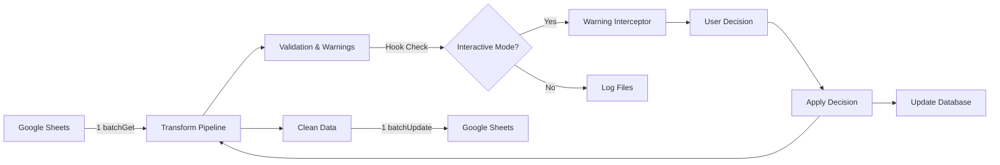

# ARQUITETURA TÉCNICA: Sistema Interativo de Warnings

## 🏗️ **Visão Arquitetural**

### **Princípios Fundamentais**
1. **Zero Breaking Changes**: Preservar 100% da funcionalidade existente
2. **Performance First**: Manter arquitetura de 2 API calls
3. **Graceful Degradation**: Sistema atual funciona se interatividade falhar
4. **Compatibility Layer**: Integrar com 10+ sistemas existentes sem conflitos

---

## 🔄 **Fluxo de Integração**

### **Estado Atual (Preservado)**
```mermaid
graph LR
    A[Google Sheets] -->|1 batchGet| B[Transform Pipeline]
    B --> C[Validation & Warnings]
    C -->|log.warning()| D[Log Files]
    B --> E[Clean Data]
    E -->|1 batchUpdate| F[Google Sheets]
```

### **Estado Proposto (Adicionado)**


---

## 📦 **Componentes Detalhados**

### **1. Warning Interceptor** (`transform/warnings/interactive_handler.py`)

#### **Responsabilidades**
- Interceptar warnings antes da supressão automática
- Pausar execução do ETL de forma segura
- Apresentar interface user-friendly
- Coletar decisões do usuário com validation

#### **Interface Pública**
```python
class WarningInterceptor:
    def __init__(self, 
                 db_path: str = "warnings.db",
                 interactive: bool = True,
                 timeout: int = 300):
        """
        Args:
            db_path: SQLite database path for decisions
            interactive: Enable/disable interactivity 
            timeout: Max seconds to wait for user input
        """
        
    def intercept(self, 
                  warning_msg: str,
                  context: WarningContext) -> UserDecision:
        """
        Main interception method.
        
        Args:
            warning_msg: The warning message text
            context: Rich context about the warning
            
        Returns:
            UserDecision: How to handle this warning
        """
        
    def should_intercept(self, warning_type: str) -> bool:
        """Check if this warning type should be intercepted."""
        
    def display_context(self, context: WarningContext) -> None:
        """Display rich context to help user decide."""
```

#### **Context Structure**
```python
@dataclass
class WarningContext:
    warning_type: str           # "validation", "schema", "bi_param"
    sheet_name: str            # "metaGeral", "linkedinGeral" 
    row_number: Optional[int]   # Specific row if applicable
    column_name: Optional[str]  # Specific column if applicable
    current_value: Any         # The problematic value
    dataframe_sample: pd.DataFrame  # Sample of surrounding data
    suggested_values: List[str] # Fuzzy-matched suggestions
    campaign_context: dict     # Cliente/Briefing hierarchy
    
    def to_display(self) -> str:
        """Format context for user display."""
```

### **2. Decision Engine** (`transform/warnings/warning_resolver.py`)

#### **Responsabilidades**
- Aplicar decisões do usuário aos dados atuais
- Persistir decisões para reutilização futura
- Atualizar classes distribuídas (Campanha, Anuncio, Plano) quando necessário
- Invalidar caches multi-classe apropriados

#### **Decision Types**
```python
class UserDecision(Enum):
    IGNORE = "ignore"              # Skip this warning, continue ETL
    FIX_VALUE = "fix_value"        # Replace with user-provided value
    ADD_TO_BI = "add_to_bi"        # Add new value to BI_PARAMETRIZAÇÃO
    CREATE_RULE = "create_rule"    # Always replace X with Y
    QUIT = "quit"                  # Stop ETL execution
    SHOW_MORE = "show_more"        # Display additional context

@dataclass
class DecisionResult:
    action_taken: UserDecision
    new_value: Optional[Any]
    rule_created: Optional[str]
    sheets_updated: bool
    cache_invalidated: List[str]
```

#### **Resolution Logic**
```python
class DecisionResolver:
    def apply_decision(self, 
                      decision: UserDecision, 
                      context: WarningContext,
                      dataframe: pd.DataFrame) -> DecisionResult:
        """
        Apply user decision to current data and system state.
        
        Args:
            decision: What user decided to do
            context: Original warning context
            dataframe: Current DataFrame to modify
            
        Returns:
            DecisionResult: What actions were performed
        """
        
    def update_distributed_classes(self, 
                                   data_type: str,
                                   new_data: dict) -> bool:
        """Update distributed data classes (Campanha, Anuncio, Plano)."""
        
    def create_substitution_rule(self, 
                               pattern: str, 
                               replacement: str) -> None:
        """Create automatic substitution rule."""
```

### **3. Rules Engine** (`transform/warnings/rules_engine.py`)

#### **Responsabilidades**
- Carregar regras persistidas na inicialização
- Aplicar regras automaticamente antes de warnings
- Gerenciar precedência e conflitos de regras
- Otimizar performance com caching inteligente

#### **Rule Types**
```python
@dataclass
class SubstitutionRule:
    id: int
    pattern: str              # What to match
    replacement: str          # What to replace with
    warning_type: str         # Which warnings this applies to
    sheet_pattern: str        # Which sheets (regex)
    active: bool = True
    created_at: datetime
    usage_count: int = 0

@dataclass  
class SuppressionRule:
    id: int
    warning_pattern: str      # Warning message pattern to suppress
    condition: str            # When to apply (sheet, column, etc)
    active: bool = True
    created_at: datetime

class RulesEngine:
    def load_rules(self) -> None:
        """Load all active rules from database."""
        
    def apply_substitution_rules(self, 
                               df: pd.DataFrame, 
                               sheet_name: str) -> pd.DataFrame:
        """Apply substitution rules before validation."""
        
    def check_suppression_rules(self, 
                              warning_msg: str, 
                              context: WarningContext) -> bool:
        """Check if warning should be suppressed by rule."""
        
    def add_rule(self, rule: Union[SubstitutionRule, SuppressionRule]) -> None:
        """Add new rule and persist to database."""
```

### **4. Database Layer** (`transform/warnings/database.py`)

#### **Schema SQLite**
```sql
-- User decisions for learning
CREATE TABLE user_decisions (
    id INTEGER PRIMARY KEY AUTOINCREMENT,
    warning_type TEXT NOT NULL,                    -- "validation", "schema", etc
    context_hash TEXT NOT NULL,                    -- Hash of warning context
    sheet_name TEXT,                               -- Which sheet caused warning
    column_name TEXT,                              -- Which column if applicable  
    original_value TEXT,                           -- Original problematic value
    user_decision TEXT NOT NULL,                   -- "ignore", "fix", "add_to_bi"
    replacement_value TEXT,                        -- New value if applicable
    created_at TIMESTAMP DEFAULT CURRENT_TIMESTAMP,
    usage_count INTEGER DEFAULT 1,
    UNIQUE(context_hash, user_decision)
);

-- Automatic rules
CREATE TABLE warning_rules (
    id INTEGER PRIMARY KEY AUTOINCREMENT,
    rule_type TEXT NOT NULL,                       -- "substitution", "suppression"
    pattern TEXT NOT NULL,                         -- What to match
    action TEXT NOT NULL,                          -- What to do
    replacement_value TEXT,                        -- For substitution rules
    sheet_pattern TEXT DEFAULT '%',               -- Which sheets (SQL LIKE)
    warning_type_filter TEXT DEFAULT '%',         -- Which warning types
    active BOOLEAN DEFAULT 1,
    created_at TIMESTAMP DEFAULT CURRENT_TIMESTAMP,
    last_used_at TIMESTAMP,
    usage_count INTEGER DEFAULT 0
);

-- Geography data (migrated from municipios.csv) 
CREATE TABLE geografia (
    id INTEGER PRIMARY KEY AUTOINCREMENT,
    cidade TEXT NOT NULL,
    estado TEXT NOT NULL,
    regiao TEXT,                                   -- Calculated: Norte, Nordeste, etc
    codigo_ibge TEXT,                              -- If needed in future
    created_at TIMESTAMP DEFAULT CURRENT_TIMESTAMP
);

-- BI Parametrização cache (optional optimization)
CREATE TABLE bi_param_cache (
    id INTEGER PRIMARY KEY AUTOINCREMENT,
    taxonomy_type TEXT NOT NULL,                   -- "campaign", "ad_name", etc
    original_value TEXT NOT NULL,
    standardized_value TEXT NOT NULL,
    confidence_score REAL,                         -- Fuzzy match confidence
    last_updated TIMESTAMP DEFAULT CURRENT_TIMESTAMP,
    UNIQUE(taxonomy_type, original_value)
);
```

#### **Database Operations**
```python
class WarningDatabase:
    def __init__(self, db_path: str = "warnings.db"):
        """Initialize database connection and create tables."""
        
    def save_decision(self, 
                     context: WarningContext, 
                     decision: UserDecision, 
                     result: DecisionResult) -> None:
        """Persist user decision for future reference."""
        
    def get_similar_decisions(self, 
                            context: WarningContext) -> List[UserDecision]:
        """Find similar past decisions to suggest to user."""
        
    def get_active_rules(self, 
                        warning_type: str = None) -> List[dict]:
        """Retrieve active rules, optionally filtered by type."""
        
    def migrate_municipios_csv(self, csv_path: str) -> None:
        """One-time migration of municipios.csv to database."""
        
    def cleanup_old_decisions(self, days: int = 90) -> None:
        """Archive old decisions to keep database size manageable."""
```

### **6. Performance Guard** (`transform/warnings/performance.py`)

#### **Responsabilidades**
- Monitorar número de chamadas API durante execução
- Garantir que sistema de warnings não ultrapasse 2 API calls
- Alertar proativamente sobre degradação de performance
- Fornecer métricas para otimização contínua

#### **Interface de Contagem**
```python
class PerformanceGuard:
    def __init__(self):
        self.api_calls = 0
        self.max_calls = 2
        self.call_log = []
        
    def before_api_call(self, operation: str) -> None:
        """Track API call before execution."""
        self.api_calls += 1
        if self.api_calls > self.max_calls:
            raise PerformanceViolation(
                f"Exceeded {self.max_calls} API calls limit!"
            )
```

### **7. Environment Integration** (`transform/warnings/environment.py`)

#### **Production Safety**
```python
class EnvironmentConfig:
    def __init__(self):
        self.interactive_mode = os.getenv("INTERACTIVE_MODE", "false").lower() == "true"
        self.production_mode = os.getenv("PRODUCTION_MODE", "false").lower() == "true"
        
    def should_intercept(self) -> bool:
        """Determine if warnings should be intercepted."""
        if self.production_mode:
            return False
        return self.interactive_mode
        
    def is_compatible_with_suppressor(self) -> bool:
        """Check compatibility with warning_suppressor.py."""
        from logs.warning_suppressor import is_suppression_active
        return not is_suppression_active()
```

---

## 🔗 **Pontos de Integração**

### **1. Architecture Pattern Resolution** ⚠️ **CRÍTICO**

#### **Builtins vs Dependency Injection**
**Problema Identificado**: Branch `refactor` usa instanciação local (`TreatPipeline` instancia seu próprio `SheetsFetcher`), enquanto documentação assume uso de `builtins` para compartilhamento.

```python
# CURRENT (branch refactor - LOCAL INSTANTIATION):
class TreatPipeline:
    def __init__(self, config):
        self.sheets_fetcher = SheetsFetcher(config)  # Local instance
        self.transform_engine = TransformEngine()

# DOCUMENTED (using builtins - GLOBAL STATE):
if hasattr(builtins, 'warning_interceptor') and builtins.warning_interceptor:
    decision = builtins.warning_interceptor.intercept(...)
```

#### **Recommended Pattern: Dependency Injection**
```python
# SOLUTION: Constructor injection without builtins
class TreatPipeline:
    def __init__(self, 
                 config,
                 sheets_fetcher: SheetsFetcher = None,
                 warning_interceptor: WarningInterceptor = None):
        self.sheets_fetcher = sheets_fetcher or SheetsFetcher(config)
        self.warning_interceptor = warning_interceptor
        
    def _handle_warning(self, warning_msg: str, context: dict):
        """Central warning handling with injected interceptor."""
        if self.warning_interceptor and self.warning_interceptor.is_active():
            return self.warning_interceptor.intercept(warning_msg, context)
        else:
            log.warning(warning_msg)  # Fallback behavior
            
# USAGE:
interceptor = WarningInterceptor() if interactive_mode else None
pipeline = TreatPipeline(config, warning_interceptor=interceptor)
```

#### **Migration Strategy**
```python
# Phase 1: Add optional injection to existing pattern
class ValidationUtils:
    def __init__(self, warning_interceptor: Optional[WarningInterceptor] = None):
        self._warning_interceptor = warning_interceptor
        
    def _log_or_intercept(self, warning_msg: str, context: dict = None):
        if self._warning_interceptor:
            return self._warning_interceptor.intercept(warning_msg, context)
        log.warning(warning_msg)  # Existing behavior preserved

# Phase 2: Update TreatPipeline to pass interceptor to utilities
class TreatPipeline:
    def __init__(self, config, warning_interceptor=None):
        self.warning_interceptor = warning_interceptor
        self.validation_utils = ValidationUtils(warning_interceptor)
```

### **2. Hook Points Identificados**

#### **Primary Hook: validation.py**
```python
# BEFORE (linha ~73 em validations.py):
log.warning("[Validação] %d valor(es) de '%s' fora da BI_PARAMETRIZAÇÃO", 
           len(missing_values), column_name)

# AFTER (using dependency injection pattern):
def check_required_columns(self, df, required_columns, sheet_name):
    """Updated with interceptor injection."""
    missing_values = find_missing_values(df, required_columns)
    
    if missing_values:
        warning_msg = f"[Validação] {len(missing_values)} valor(es) de '{column_name}' fora da BI_PARAMETRIZAÇÃO"
        
        if self._warning_interceptor:
            context = WarningContext(
                warning_type="bi_parametrization",
                sheet_name=sheet_name,
                column_name=column_name,
                current_value=missing_values[0],
                suggested_values=get_fuzzy_matches(missing_values[0]),
                dataframe_sample=df.head(3)
            )
            decision = self._warning_interceptor.intercept(warning_msg, context)
            if decision.action_taken != UserDecision.IGNORE:
                return apply_decision_to_dataframe(decision, context, df)
        else:
            log.warning(warning_msg)  # Original behavior preserved
```

#### **Secondary Hook: schema_validator.py**
```python
# Similar pattern for schema warnings
if interactive_mode_enabled():
    context = create_schema_warning_context(missing_columns, sheet_name)
    decision = intercept_schema_warning(context)
    handle_schema_decision(decision)
else:
    log.warning("Missing columns: %s", missing_columns)
```

### **2. Compatibility Layer**

#### **Production Mode Integration**
```python
# In warning_interceptor.py __init__:
def __init__(self, **kwargs):
    # Check if production mode is active
    if is_production_mode():
        self.interactive = False  # Force non-interactive in production
        self.fallback_to_logs = True
    
    # Check if warnings are suppressed
    if warnings_are_suppressed():
        # Hook at a higher level, before suppression
        self.hook_level = "pre_suppression"
    else:
        self.hook_level = "standard"
```

#### **Cache Integration**
```python
# Integration with BIParamLookup cache
class WarningResolver:
    def invalidate_caches_after_decision(self, decision: DecisionResult):
        """Invalidate relevant caches when data changes."""
        if decision.sheets_updated:
            # Force BIParamLookup to reload
            if hasattr(builtins, 'bi_param_lookup'):
                builtins.bi_param_lookup._force_reload()
            
            # Clear worksheet cache if we updated BI_PARAMETRIZAÇÃO
            clear_worksheet_cache("BI_PARAMETRIZAÇÃO")
```

#### **Performance Preservation**
```python
# Ensure 2 API call architecture is maintained
class PerformanceGuard:
    def __init__(self):
        self.api_call_count = 0
        self.max_api_calls = 2  # Hard limit
        
    def before_api_call(self, operation: str):
        """Track API calls to ensure we don't exceed limit."""
        self.api_call_count += 1
        if self.api_call_count > self.max_api_calls:
            raise PerformanceError(f"Exceeded API call limit: {operation}")
    
    def sheets_update_for_warning_resolution(self, updates: List[dict]):
        """Batch warning-related updates with existing batchUpdate."""
        # Add to existing consolidated write-back instead of separate call
        add_to_consolidated_payload(updates)
```

#### **Enhanced Context Integration**
```python
# Leverage existing optimizations for rich context
class EnhancedContextBuilder:
    def __init__(self):
        self.sheet_normalizer = SheetNameNormalizer()
        self.column_mapper = SmartColumnMapper()
        
    def build_warning_context(self, 
                             warning_type: str,
                             sheet_name: str, 
                             problematic_value: Any) -> WarningContext:
        """Build rich context using existing optimizations."""
        # Use existing sheet name normalization
        normalized_name = self.sheet_normalizer.normalize(sheet_name)
        friendly_name = self.sheet_normalizer.get_display_name(sheet_name)
        
        # Leverage existing caches for context
        context_data = {}
        if hasattr(builtins, '_last_taxo_report'):
            context_data['taxonomy'] = builtins._last_taxo_report
        if hasattr(builtins, '_last_impressions_report'):
            context_data['impressions'] = builtins._last_impressions_report
            
        # Use smart column mapping for suggestions
        suggestions = []
        if warning_type == "bi_parametrization":
            suggestions = self.column_mapper.get_fuzzy_matches(
                problematic_value, 
                context_data.get('taxonomy', {})
            )
            
        return WarningContext(
            warning_type=warning_type,
            sheet_name=friendly_name,
            current_value=problematic_value,
            suggested_values=suggestions,
            context_data=context_data,
            normalized_sheet_name=normalized_name
        )
```

---

## 🚦 **Error Handling & Resilience**

### **Fallback Strategy**
```python
class GracefulDegradation:
    def handle_interactive_failure(self, error: Exception) -> None:
        """When interactive system fails, fall back to original behavior."""
        log.error("Interactive warning system failed: %s", error)
        log.info("Falling back to standard warning logging")
        
        # Disable interactivity for remainder of session
        if hasattr(builtins, 'warning_interceptor'):
            builtins.warning_interceptor.interactive = False
        
        # Continue with original warning behavior
        self.use_original_warning_system()
```

### **Timeout Handling**
```python
class TimeoutManager:
    def wait_for_user_input(self, timeout: int = 300) -> Optional[str]:
        """Wait for user input with timeout."""
        try:
            # Use signal-based timeout for user input
            signal.signal(signal.SIGALRM, timeout_handler)
            signal.alarm(timeout)
            
            user_input = input("Your choice: ").strip().lower()
            signal.alarm(0)  # Cancel timeout
            return user_input
            
        except TimeoutError:
            print(f"\nTimeout after {timeout}s. Using default action: IGNORE")
            return "i"  # Default to ignore
            
        except KeyboardInterrupt:
            print("\nKeyboard interrupt detected. Exiting gracefully.")
            return "q"  # Quit on Ctrl+C
```

### **State Recovery**
```python
class StateManager:
    def save_checkpoint(self, sheet_name: str, progress: dict) -> None:
        """Save progress checkpoint in case of failure."""
        checkpoint = {
            "sheet_name": sheet_name,
            "progress": progress,
            "timestamp": datetime.now(),
            "decisions_made": self.get_session_decisions()
        }
        
        with open(f"checkpoint_{sheet_name}.json", "w") as f:
            json.dump(checkpoint, f, default=str)
    
    def recover_from_checkpoint(self, checkpoint_file: str) -> dict:
        """Recover state from checkpoint file."""
        with open(checkpoint_file) as f:
            return json.load(f)
```

---

## 🔧 **Configuration & Deployment**

### **Configuration File** (`warning_config.yaml`)
```yaml
# Interactive Warning System Configuration

# Global settings
interactive_mode: true              # Enable/disable interactivity
timeout_seconds: 300               # Max wait for user input
auto_save_decisions: true          # Automatically save decisions to DB

# Warning types to intercept
intercept_warning_types:
  - "bi_parametrization"           # Missing BI_PARAMETRIZAÇÃO values
  - "schema_validation"            # Missing/extra columns
  - "data_validation"              # Data quality issues
  - "consistency_check"            # Cross-model consistency

# Suppression (warnings to never show interactively)
suppress_warning_patterns:
  - "Connection pool:"             # Technical infrastructure
  - "urllib3.connectionpool"       # HTTP connection details
  - "Rate limiting applied"        # Expected rate limiting

# Database settings
database:
  path: "warnings.db"
  backup_frequency: "daily"
  cleanup_after_days: 90

# BI_PARAMETRIZAÇÃO integration
bi_integration:
  auto_add_values: false           # Require user confirmation
  fuzzy_match_threshold: 0.8       # Similarity threshold for suggestions
  max_suggestions: 5               # Max suggestions to show user

# Performance settings  
performance:
  preserve_api_limit: true         # Enforce 2 API call limit
  batch_bi_updates: true           # Batch BI updates with main write
  cache_invalidation: "smart"      # Invalidate only affected caches

# Development settings (dev mode only)
development:
  debug_contexts: false            # Show debug info in warnings
  simulate_warnings: false         # Add artificial warnings for testing
  performance_monitoring: true     # Track performance impact
```

### **Environment Variables**
```bash
# Core settings
WARNINGS_INTERACTIVE_MODE=true
WARNINGS_TIMEOUT=300
WARNINGS_DB_PATH="warnings.db"

# Compatibility
PRESERVE_PRODUCTION_MODE=true
RESPECT_WARNING_SUPPRESSION=true
MAINTAIN_API_LIMITS=true

# Development
WARNINGS_DEBUG=false
WARNINGS_SIMULATE=false
```

### **Deployment Strategy**

#### **Phase 1: Pilot (1 warning type)**
```python
# Enable only for BI_PARAMETRIZAÇÃO warnings
INTERCEPT_TYPES = ["bi_parametrization"]
FALLBACK_ENABLED = True
MONITORING_LEVEL = "detailed"
```

#### **Phase 2: Gradual Rollout**  
```python
# Add schema warnings
INTERCEPT_TYPES = ["bi_parametrization", "schema_validation"]
PERFORMANCE_MONITORING = True
```

#### **Phase 3: Full Deployment**
```python
# All warning types
INTERCEPT_TYPES = ["all"]
PRODUCTION_READY = True
```

---

## 📊 **Performance Monitoring**

### **Metrics to Track**
```python
class PerformanceMetrics:
    def __init__(self):
        self.metrics = {
            "api_calls_count": 0,               # Must stay <= 2
            "intercept_time_ms": [],            # Time spent in interception
            "user_decision_time_s": [],         # Time user takes to decide
            "database_operation_time_ms": [],   # DB operations performance
            "cache_hit_rate": 0.0,              # Cache effectiveness
            "warnings_per_session": 0,          # Warning frequency
            "auto_resolution_rate": 0.0,        # % resolved by rules
        }
    
    def track_interception(self, warning_type: str, duration_ms: float):
        """Track time spent in warning interception."""
        
    def track_user_decision(self, decision_time_seconds: float):
        """Track how long user takes to make decisions."""
        
    def generate_performance_report(self) -> dict:
        """Generate performance report for analysis."""
```

### **Performance Alerts**
```python
class PerformanceAlerts:
    def check_api_call_limit(self, current_count: int):
        """Alert if approaching API call limit."""
        if current_count >= 2:
            raise CriticalError("API call limit reached - performance degradation")
    
    def check_response_time(self, operation: str, duration_ms: float):
        """Alert on slow operations."""
        thresholds = {
            "intercept": 100,      # 100ms max for interception
            "database": 50,        # 50ms max for DB operations
            "display": 200,        # 200ms max for context display
        }
        
        if duration_ms > thresholds.get(operation, 1000):
            log.warning("Slow operation detected: %s took %dms", 
                       operation, duration_ms)
```

---

## 🎯 **Success Criteria**

### **Technical Metrics**
- ✅ **API Calls**: Exactly 2 calls maintained (no degradation)
- ✅ **Response Time**: < 100ms overhead for interception check
- ✅ **Memory Usage**: < 50MB additional memory for warning system
- ✅ **Error Rate**: < 0.1% failure rate in interactive mode
- ✅ **Recovery Time**: < 5s to recover from any interactive failure

### **User Experience Metrics**
- ✅ **Decision Time**: < 30s average per warning resolution
- ✅ **Auto Resolution**: > 90% warnings auto-resolved after initial setup
- ✅ **Context Clarity**: Users can make informed decisions > 95% of time
- ✅ **Learning Curve**: < 5 minutes to understand interface

### **System Integration Metrics**
- ✅ **Backward Compatibility**: 100% existing functionality preserved
- ✅ **Production Mode**: Works seamlessly with production logging
- ✅ **Cache Coherence**: All caches properly invalidated when needed
- ✅ **State Consistency**: Database always in consistent state

---

**Documento criado**: 2025-01-09  
**Arquiteto**: Claude  
**Status**: Especificação técnica completa  
**Próxima revisão**: Antes da implementação

*🔗 Related docs: `PRE_PROJETO_WARNINGS.md`, `SPRINT_PLANNING.md`, `TDAH_OPTIMIZATION.md`*