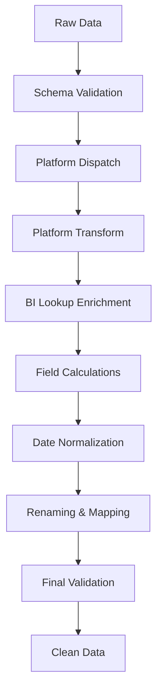

# CLAUDE.md - Transform Layer 🔄

## Responsabilidade
**Transformação completa de dados brutos em dados limpos, validados e enriquecidos - processamento 100% em memória.**

## 🎯 Arquitetura de Transformação

### Estratégia Principal: Zero I/O Processing
```python
# Dados chegam da Extract → Transform em memória → Send para Load
raw_data = extract_output      # 📥 From Extract
clean_data = transform(raw_data)  # 🔄 In-Memory Processing  
load_input = prepare(clean_data)  # 📤 To Load
```

**Benefício**: Processamento entre Extract e Load é instantâneo - zero chamadas API.

## 🏗️ Componentes Principais

### 1. TreatPipeline (`transform_pipeline.py`)
**Pipeline principal de transformação com dispatch automático por plataforma**

#### Funcionalidades:
- ✅ **Platform Routing**: Auto-detecção Meta/LinkedIn/TikTok/Pinterest/GA
- ✅ **Schema Validation**: Validação antecipada de estruturas
- ✅ **BI Lookups**: Enriquecimento com dados de parametrização
- ✅ **Field Calculations**: Campos calculados (engajamento, IDs, etc)
- ✅ **Date Normalization**: Padronização de datas de campanha

#### Uso Típico:
```python
from transform.transform.transform_pipeline import TreatPipeline

pipeline = TreatPipeline(
    creds_path="creds.json",
    spreadsheet_id="1jP...",
    sheet_name="metaGeral",
    mapping_renomeacao=renomeacao_geral,
    write_back=False  # 🚀 KEY: In-memory only
)

df_clean = pipeline.run(df_raw)  # 🔄 Transform magic happens
```

### 2. Platform Dispatch (`platforms/__init__.py`)
**Roteamento automático para transformações específicas por plataforma**

#### Supported Platforms:
- **Meta**: `platforms/meta.py` → Facebook/Instagram ads
- **LinkedIn**: `platforms/linkedin.py` → LinkedIn campaigns  
- **TikTok**: `platforms/tiktok.py` → TikTok ads
- **Pinterest**: `platforms/pinterest.py` → Pinterest campaigns
- **GA**: `platforms/ga.py` → Google Analytics

#### Auto-Detection Logic:
```python
def dispatch(sheet_name: str):
    lower = sheet_name.lower()
    if lower.startswith("meta"):     return meta.transform_meta
    elif lower.startswith("tiktok"): return tiktok.transform_tiktok  
    elif lower.startswith("linkedin"): return linkedin.transform_linkedin
    elif lower.startswith("pinterest"): return pinterest.transform_pinterest
    elif lower.startswith("gageral"): return ga.transform_ga
    else: return lambda df, lookup=None: df  # No-op fallback
```

### 3. Utils Ecosystem (`utils/`)
**Comprehensive transformation utilities**

#### Core Utils:
- **`renomeacoes.py`**: Column name standardization
- **`campos_calculados.py`**: Calculated fields (engagement, CTR, etc)
- **`validations.py`**: Data quality validation
- **`geo_normalize.py`**: Geographic data standardization
- **`date_normalizer.py`**: Campaign date consistency

#### Advanced Utils:
- **`atribuicoes_via_lookup.py`**: Attribution mapping
- **`campanha_mapper.py`**: Campaign name standardization  
- **`utm_lookup.py`**: UTM parameter enrichment
- **`creative_mapping.py`**: Creative asset mapping

## 🚀 Performance Optimizations

### 1. In-Memory Processing
```python
# All transformations happen in RAM - zero I/O
df_raw → validate → normalize → enrich → calculate → df_clean
```

### 2. Early Schema Validation  
```python
from transform.transform.utils.schema_validator import validate_schema_early
schema_issues = validate_schema_early(df_raw, sheet_name, warn_only=True)
# Catch issues before expensive processing
```

### 3. Smart Lookups
```python
from transform.transform.bi_param_utils import BIParamLookup
# Cached BI lookups - loaded once, used many times
lookup = BIParamLookup(creds_path, spreadsheet_id)
```

### 4. Date Consistency Validation
```python  
from transform.transform.utils.validations import validate_consistent_dates_across_models
inconsistencies = validate_consistent_dates_across_models(dest_dfs)
# Cross-model date validation
```

## 🔄 Transformation Pipeline Flow

### Complete Transform Process:


### Code Flow:
```python
def run_etl_for_sheet(sheet: str, preloaded_raw: pd.DataFrame):
    # 0) Early exit check
    skip_sheet, reason = should_skip_sheet(preloaded_raw, sheet)
    if skip_sheet: return
    
    # 1) Schema validation
    schema_issues = validate_schema_early(df_raw, sheet, warn_only=True)
    
    # 2) Transform pipeline
    pipeline = TreatPipeline(...)
    df_ok = pipeline.run(df_raw)  # 🎯 Core transformation
    
    # 3) Date normalization  
    df_ok = normalize_campaign_dates(df_ok)
    
    # 4) Column renaming
    df_model = renomear_colunas_origem_para_modelo(df_ok, renomeacao_geral)
    
    # 5) Calculated fields
    df_model = calcular_engajamento_total(df_model) 
    df_model["ID"] = df_model.apply(gerar_id, axis=1)
    
    return df_model  # Ready for Load layer
```

## 📊 Data Quality & Validation

### Schema Validation:
- **Expected columns**: Platform-specific required fields
- **Data types**: Automatic type inference and conversion
- **Missing data**: Smart handling of null/empty values

### Cross-Model Consistency:
- **Date ranges**: Campaign start/end consistency
- **Attribution**: Proper attribution mapping
- **Metrics**: Calculation consistency across platforms

### Quality Metrics:
```python
# Deduplication stats
total_rows = sum(len(df) for df in all_dfs)
new_rows = count_unique_records(all_dfs)
duplicate_percentage = (total_rows - new_rows) / total_rows * 100
```

## 🛠️ Configuration

### Key Settings (`settings.py`):
```python
# Platform-specific configurations
META_REQUIRED_FIELDS = ["campaign_name", "ad_set_name", ...]
LINKEDIN_REQUIRED_FIELDS = ["campaign_group", "campaign", ...]

# Validation settings
ENABLE_STRICT_VALIDATION = True
WARN_ON_MISSING_COLUMNS = True
```

### Renaming Maps (`renomeacoes.py`):
```python
renomeacao_geral = {
    # Platform → Standard naming
    "campaign_name": "campanha",
    "ad_set_name": "grupo_anuncios", 
    "impressions": "impressoes",
    # ... comprehensive mapping
}
```

## 🐛 Common Issues & Solutions

### 1. Platform Detection Issues
**Cause**: Sheet name doesn't match platform patterns  
**Solution**: Check `dispatch()` logic in `platforms/__init__.py`

### 2. Missing Column Warnings  
**Cause**: Platform data doesn't have expected fields  
**Solution**: Update field lists in `utils/fields_lists.py`

### 3. Date Inconsistencies
**Cause**: Different date formats across platforms  
**Solution**: `date_normalizer.py` handles format standardization

### 4. BI Lookup Failures
**Cause**: BI_PARAMETRIZAÇÃO sheet issues  
**Solution**: Validate SOURCE sheet and lookup mappings

## 🔍 Debugging

### Enable Transform Debugging:
```python
import logging
logging.getLogger('transform.transform').setLevel(logging.DEBUG)
```

### Key Debug Messages:
- `🔄 Processando aba em memória` - Transform started
- `🔍 Schema validation found N missing columns` - Validation issues
- `📊 Platform dispatch: X → transform_X` - Platform routing
- `✅ Transform concluído` - Transform completed

## 📈 Performance Metrics

### Processing Speed:
- **In-Memory**: ~1-2 seconds per sheet
- **No I/O**: Zero API calls during transform
- **Parallel Ready**: Could process sheets in parallel

### Memory Usage:
- **Efficient**: DataFrames processed in-place when possible
- **Cleanup**: Garbage collection after each sheet
- **Caching**: BI lookups cached for reuse

---

**Key Success Metric**: 100% in-memory processing, zero API calls  
**Status**: All platforms supported, fully validated  
**Last Updated**: 2025-01-09